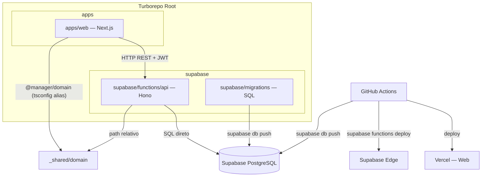

# Monorepo Boilerplate Design

**Spec:** `.specs/features/monorepo-boilerplate/spec.md`
**Status:** Updated — Backend migrado para Hono + Supabase Edge Functions

---

## Architecture Overview



---

## Monorepo Structure

```
/
├── supabase/
│   ├── config.toml
│   ├── migrations/
│   │   ├── 20240101000000_initial.sql
│   │   └── 20240102000000_add-refresh-tokens.sql
│   └── functions/
│       ├── _shared/
│       │   └── domain/             ← fonte da verdade (entidades, VOs, exceções)
│       └── api/                    ← Hono Edge Function (Deno)
├── apps/
│   └── web/                        ← Next.js 15
├── .github/
│   └── workflows/
│       ├── ci.yml
│       ├── deploy-api.yml          ← supabase db push + functions deploy
│       └── deploy-web.yml
├── turbo.json
└── package.json                    ← root workspaces (apps/web)
```

---

## Domain Compartilhado — Design

**Localização:** `supabase/functions/_shared/domain/` (fonte única da verdade)

**Acesso:**
- Edge Function: importação direta via path relativo (`../_shared/domain/`)
- Frontend: alias `@manager/domain` em `apps/web/tsconfig.json` → `../../supabase/functions/_shared/domain/index.ts`

**Exports:** entities (`User`, `Service`), value objects (`Email`), exceptions (`DomainException`)

---

## Backend (supabase/functions/api) — Hono + Deno

### Estrutura

```
supabase/functions/api/
├── index.ts                   ← entry point: Hono app + serve()
├── db.ts                      ← instância postgres (postgresjs Deno)
├── routes/
│   ├── auth.ts                ← POST /auth/register, POST /auth/login
│   ├── users.ts               ← CRUD /users (protegido)
│   └── services.ts            ← CRUD /services (protegido)
├── repositories/
│   ├── user.repository.ts     ← SQL direto
│   └── service.repository.ts
├── use-cases/
│   ├── user/
│   │   ├── create-user.ts
│   │   ├── get-user.ts
│   │   ├── update-user.ts
│   │   └── delete-user.ts
│   └── service/
│       ├── create-service.ts
│       ├── get-service.ts
│       ├── update-service.ts
│       └── delete-service.ts
├── middleware/
│   └── auth.ts                ← Hono JWT middleware
└── domain/                    ← cópia dos tipos de @manager/domain
    ├── entities/
    │   ├── user.entity.ts
    │   └── service.entity.ts
    └── exceptions/
        └── domain.exception.ts
```

### Entry Point

```typescript
// index.ts
import { Hono } from 'npm:hono'
import { cors } from 'npm:hono/cors'
import { authRoutes } from './routes/auth.ts'
import { userRoutes } from './routes/users.ts'
import { serviceRoutes } from './routes/services.ts'

const app = new Hono().basePath('/api')

app.use('*', cors({ origin: Deno.env.get('CORS_ORIGIN') ?? '*' }))
app.get('/health', (c) => c.json({ status: 'ok' }))
app.route('/auth', authRoutes)
app.route('/users', userRoutes)
app.route('/services', serviceRoutes)

Deno.serve(app.fetch)
```

### Auth Middleware

```typescript
// middleware/auth.ts
import { jwt } from 'npm:hono/jwt'

export const authMiddleware = jwt({
  secret: Deno.env.get('JWT_SECRET')!,
})
```

### Rotas protegidas

```typescript
// routes/users.ts
import { Hono } from 'npm:hono'
import { authMiddleware } from '../middleware/auth.ts'

const users = new Hono()
users.use('*', authMiddleware)

users.get('/', async (c) => { /* GetUserUseCase.findAll() */ })
users.get('/:id', async (c) => { /* GetUserUseCase.findById() */ })
users.post('/', async (c) => { /* CreateUserUseCase.execute() */ })
users.patch('/:id', async (c) => { /* UpdateUserUseCase.execute() */ })
users.delete('/:id', async (c) => { /* DeleteUserUseCase.execute() */ })

export const userRoutes = users
```

### Database Client

```typescript
// db.ts
import postgres from 'https://deno.land/x/postgresjs/mod.js'

const sql = postgres(Deno.env.get('DATABASE_URL')!)
export default sql
```

### Repository (exemplo)

```typescript
// repositories/user.repository.ts
import sql from '../db.ts'
import type { User } from '../../_shared/domain/entities/user.entity.ts'

export const UserRepository = {
  async findByEmail(email: string): Promise<User | null> {
    const [row] = await sql`SELECT * FROM users WHERE email = ${email}`
    return row ? toUser(row) : null
  },
  async findById(id: string): Promise<User | null> {
    const [row] = await sql`SELECT * FROM users WHERE id = ${id}`
    return row ? toUser(row) : null
  },
  async create(data: Pick<User, 'name' | 'email' | 'passwordHash'>): Promise<User> {
    const [row] = await sql`
      INSERT INTO users (name, email, password_hash)
      VALUES (${data.name}, ${data.email}, ${data.passwordHash})
      RETURNING *
    `
    return toUser(row)
  },
  async update(id: string, data: Partial<Pick<User, 'name'>>): Promise<User> {
    const [row] = await sql`
      UPDATE users SET name = ${data.name}, updated_at = now()
      WHERE id = ${id} RETURNING *
    `
    return toUser(row)
  },
  async delete(id: string): Promise<void> {
    await sql`DELETE FROM users WHERE id = ${id}`
  },
}

function toUser(row: Record<string, unknown>): User {
  return new User(
    row.id as string,
    row.name as string,
    row.email as string,
    row.password_hash as string,
    row.created_at as Date,
    row.updated_at as Date,
  )
}
```

### Data Models

**Migration SQL** (`supabase/migrations/20240101000000_initial.sql`):

```sql
CREATE TABLE "users" (
  "id"            UUID NOT NULL DEFAULT gen_random_uuid(),
  "name"          VARCHAR(255) NOT NULL,
  "email"         VARCHAR(255) NOT NULL,
  "password_hash" VARCHAR(255) NOT NULL,
  "created_at"    TIMESTAMP NOT NULL DEFAULT now(),
  "updated_at"    TIMESTAMP NOT NULL DEFAULT now(),
  CONSTRAINT "UQ_users_email" UNIQUE ("email"),
  CONSTRAINT "PK_users" PRIMARY KEY ("id")
);

CREATE TYPE "services_tipo_enum" AS ENUM ('OBRA_INCENDIO', 'CONSULTORIA', 'PROJETO', 'MANUTENCAO');
CREATE TYPE "services_status_enum" AS ENUM ('EM_ANDAMENTO', 'CONCLUIDO', 'PAUSADO', 'CANCELADO');
CREATE TYPE "services_forma_pagamento_enum" AS ENUM ('A_VISTA', 'PARCELADO', 'MENSAL');

CREATE TABLE "services" (
  "id"              UUID NOT NULL DEFAULT gen_random_uuid(),
  "cliente"         JSONB NOT NULL,
  "tipo"            "services_tipo_enum" NOT NULL,
  "status"          "services_status_enum" NOT NULL,
  "data_inicio"     DATE NOT NULL,
  "data_fim"        DATE,
  "valor_total"     DECIMAL(10,2) NOT NULL,
  "forma_pagamento" "services_forma_pagamento_enum" NOT NULL,
  "cronograma"      JSONB,
  "pagamentos"      JSONB,
  "documentos"      JSONB,
  "custos_fixos"    JSONB,
  "parcelamento"    JSONB,
  "created_at"      TIMESTAMP NOT NULL DEFAULT now(),
  "updated_at"      TIMESTAMP NOT NULL DEFAULT now(),
  CONSTRAINT "PK_services" PRIMARY KEY ("id")
);
```

---

## Frontend (apps/web) — Clean Architecture

### Estrutura de Camadas

```
src/
├── domain/
│   ├── entities/
│   │   ├── user.entity.ts         ← re-exporta @manager/domain
│   │   └── service.entity.ts
│   ├── repositories/
│   │   ├── user.repository.ts     ← interface IUserRepository
│   │   └── service.repository.ts
│   └── value-objects/
│       └── email.vo.ts
│
├── application/
│   ├── use-cases/
│   │   ├── user/
│   │   │   ├── create-user.use-case.ts
│   │   │   ├── get-users.use-case.ts
│   │   │   └── delete-user.use-case.ts
│   │   └── auth/
│   │       ├── login.use-case.ts
│   │       └── logout.use-case.ts
│   └── ports/
│       └── auth-token.port.ts
│
├── infrastructure/
│   ├── http/
│   │   ├── user.http-repository.ts
│   │   ├── service.http-repository.ts
│   │   └── auth.http-repository.ts
│   ├── storage/
│   │   └── local-storage-token.ts
│   └── di/
│       └── container.ts
│
└── presentation/
    ├── components/
    │   ├── ui/
    │   └── shared/
    ├── app/
    │   ├── (auth)/login/page.tsx
    │   ├── (auth)/register/page.tsx
    │   └── (dashboard)/
    │       ├── layout.tsx
    │       ├── page.tsx
    │       ├── services/page.tsx
    │       └── users/page.tsx
    ├── hooks/
    └── contexts/
        └── auth.context.tsx
```

---

## CI/CD — GitHub Actions

### `.github/workflows/ci.yml`
- Trigger: push/PR em qualquer branch
- Jobs: lint, build packages, test
- **Removido:** job `check-migrations` (TypeORM dry-run)

### `.github/workflows/deploy-api.yml`
- Trigger: push em `main` com mudanças em `supabase/**` ou `packages/**`
- Steps:
  1. Setup Supabase CLI
  2. `supabase db push --linked` — aplica migrations pendentes
  3. `supabase functions deploy api` — deploy da edge function

### `.github/workflows/deploy-web.yml`
- Trigger: push em `main` com mudanças em `apps/web/**` ou `packages/**`
- Steps: build → `vercel --prod`

---

## Error Handling Strategy

| Error Scenario                  | Backend (Hono)                         | Frontend Impact                  |
|---------------------------------|----------------------------------------|----------------------------------|
| Credenciais inválidas           | `c.json({ error: 'Unauthorized' }, 401)` | Mensagem de erro no form       |
| Email duplicado                 | `c.json({ error: 'Email in use' }, 409)` | Mensagem "email já em uso"    |
| Resource não encontrado         | `c.json({ error: 'Not found' }, 404)`  | Toast de erro                    |
| Token inválido/expirado         | Hono JWT middleware retorna 401        | Redirect para /login             |
| Validação falha                 | `c.json({ error: '...', details: [] }, 400)` | Erros no form             |
| DB error                        | `c.json({ error: 'Internal error' }, 500)` | Mensagem genérica           |

---

## Tech Decisions

| Decision                              | Choice                                 | Rationale                                                   |
|---------------------------------------|----------------------------------------|-------------------------------------------------------------|
| Monorepo tooling                      | Turborepo                              | Padrão para TS monorepos, cache de build, pipelines claras  |
| Backend framework                     | Hono                                   | Edge-native (Deno), DX idêntico ao Fastify, TypeScript-first |
| Backend runtime                       | Deno (Supabase Edge Functions)         | Edge sem cold start, sem custo fixo de servidor             |
| Database access                       | postgresjs (Deno) — SQL direto         | TypeORM incompatível com Deno; SQL direto mais simples      |
| Migrations                            | Supabase CLI — arquivos SQL            | Ecossistema único, SQL puro versionado, sem magia de ORM    |
| Auth library                          | hono/jwt + bcryptjs (Deno)             | Sem acoplamento ao Supabase Auth, controle total            |
| Password hashing                      | bcryptjs                               | Sem dependências nativas, simples e seguro                  |
| Frontend framework                    | Next.js 15 App Router                  | SSR, roteamento por pasta, ecosystem React maduro           |
| Frontend HTTP client                  | Axios (mantido)                        | Já em uso, interceptors prontos                             |
| Frontend DI                           | Factory functions (sem container lib)  | Simples, sem overhead de lib de DI para o frontend          |
| Services sub-fields (cronograma etc.) | JSONB columns no PostgreSQL            | Preserva flexibilidade sem criar 6 tabelas extras           |
| @manager/domain no Deno               | `_shared/domain/` — path relativo      | Supabase Edge Runtime isola a função; symlinks externos falham; _shared/ está dentro do sandbox |
